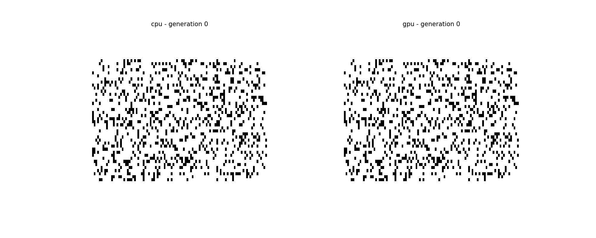
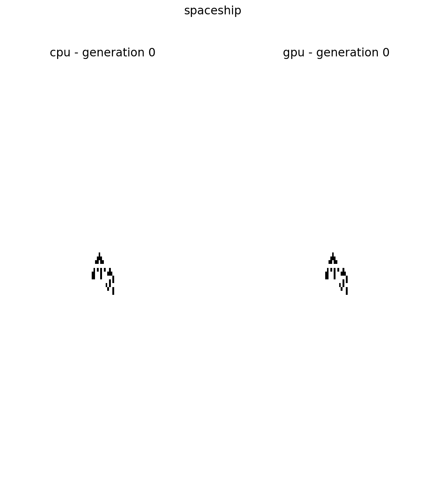

# Conway's game of life

Implementation of Conway's game of life in C++ and CUDA.

### Game's rules

1. Any live cell with two or three live neighbours survives.
2. Any dead cell with three live neighbours becomes a live cell.
3. All other live cells die in the next generation. Similarly, all other dead cells stay dead.

### How to run

- To compile use the use: 
    1. nvcc -c conway_gpu.cu conway.cpp
    2. nvcc conway_gpu.o conway.o simulate.cu -o simulate

- To generate the data run:
    1. ./simulate cpu random
    2. ./simulate cpu spaceship
    3. ./simulate gpu random
    4. ./simulate gpu spaceship

- To plot the results run:
    1. ipython plotting random
    2. ipython plotting spaceship

#### Simulatuion with randomly initiated grid

#### Simulatuion with grid initiated with [30P5H2V0](https://bitstorm.org/gameoflife/lexicon/#bk5) spaceship

### Run benchmark

To run the benchmark first compile with:

1. nvcc -c conway_gpu.cu conway.cpp
2. nvcc conway_gpu.o conway.o benchmark.cu -o benchmark

And then run the bash script ./run_benchmark.sh. Bellow is the output for 10000 iterations.

---------------------------------------------------
grid size: 400 CPU: 0.321601, GPU: 0.0406112, err: 0
---------------------------------------------------
grid size: 900 CPU: 0.588414, GPU: 0.0430662, err: 0
---------------------------------------------------
grid size: 1600 CPU: 0.925208, GPU: 0.0428471, err: 0
---------------------------------------------------
grid size: 2500 CPU: 1.34808, GPU: 0.0420579, err: 0
---------------------------------------------------
grid size: 3600 CPU: 1.85368, GPU: 0.0428913, err: 0
---------------------------------------------------
grid size: 4900 CPU: 2.4401, GPU: 0.0465378, err: 0
---------------------------------------------------
grid size: 6400 CPU: 3.06343, GPU: 0.0452165, err: 0
---------------------------------------------------
grid size: 8100 CPU: 3.84234, GPU: 0.0507386, err: 0
---------------------------------------------------
grid size: 10000 CPU: 4.61692, GPU: 0.050002, err: 0
---------------------------------------------------
grid size: 12100 CPU: 5.50207, GPU: 0.0493743, err: 0
---------------------------------------------------

