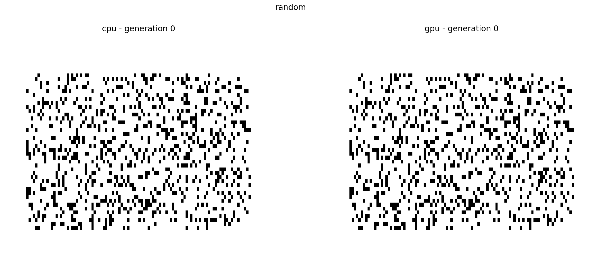

# Conway's game of life

Implementation of Conway's game of life in C++ and CUDA.

### Game's rules

1. Any live cell with two or three live neighbours survives.
2. Any dead cell with three live neighbours becomes a live cell.
3. All other live cells die in the next generation. Similarly, all other dead cells stay dead.

### How to run

- To compile use the use: 
    1. nvcc -c conway_gpu.cu conway.cpp
    2. nvcc conway_gpu.o conway.o simulate.cu -o simulate

- To generate the data run:
    1. ./simulate cpu random
    2. ./simulate cpu spaceship
    3. ./simulate gpu random
    4. ./simulate gpu spaceship

- To plot the results run:
    1. ipython plotting random
    2. ipython plotting spaceship

#### Simulatuion with randomly initiated grid

#### Simulatuion with grid initiated with [30P5H2V0](https://bitstorm.org/gameoflife/lexicon/#bk5) spaceship

### Run benchmark

To run the benchmark first compile with:

1. nvcc -c conway_gpu.cu conway.cpp
2. nvcc conway_gpu.o conway.o benchmark.cu -o benchmark

And then run the bash script ./run_benchmark.sh. Bellow is the output for 100000 iterations.

|  grid  |  t_cpu [s]  |  t_gpu [s] |  err  |

|  400   |   3.27869   |  0.381443  |   0   |
|  900   |   6.03539   |  0.367432  |   0   |
|  1600  |   9.54228   |  0.362275  |   0   |
|  2500  |   13.9355   |  0.386967  |   0   |
|  3600  |   18.9013   |  0.392833  |   0   |
|  4900  |   24.9878   |  0.385277  |   0   |
|  6400  |   31.363    |  0.40496   |   0   |
|  8100  |   39.3561   |  0.417143  |   0   |
|  10000 |   47.1459   |  0.449636  |   0   |
|  12100 |   56.6858   |  0.426525  |   0   |
